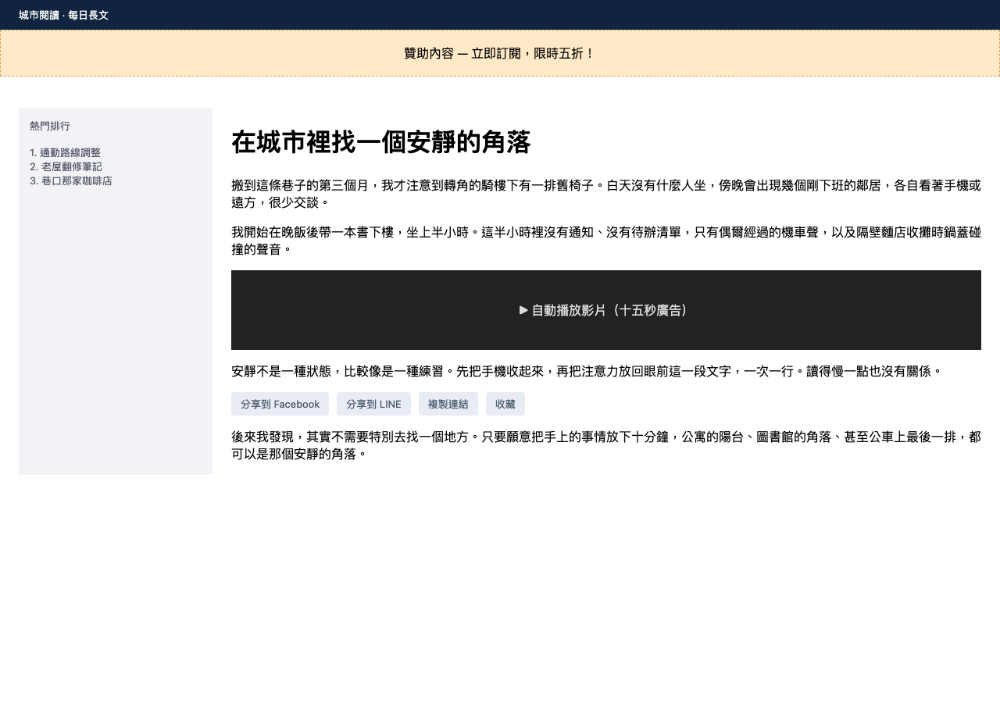
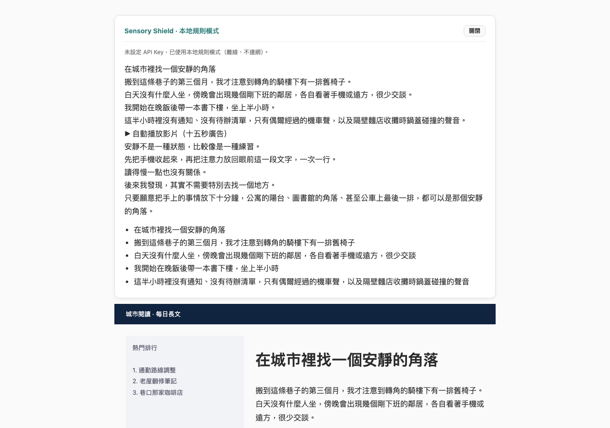

# Sensory Shield

> A Manifest V3 browser extension that turns overwhelming pages into a calm, low-stimulation reading view.

[](#)
[](#)
[](#)
[](LICENSE)
[](https://tewei02.github.io/sensory-shield/)

**Live demo and download:** <https://tewei02.github.io/sensory-shield/>
**Installation guide:** [INSTALL.md](INSTALL.md) · [繁體中文說明](README.zh-TW.md)

| Before | After |
| --- | --- |
|  |  |

*Both frames come from [`tests/preview.html`](tests/preview.html), the repository's own preview page.*

---

## Overview

Sensory Shield is a reading-comfort tool for the browser. On a page you are already reading, it:

1. hides media and advertising or overlay containers with conservative, token-matched selectors;
2. extracts the main text (up to 8,000 characters per run);
3. returns a neutral, bullet-pointed version of that text and renders it in a card at the top of the page;
4. applies a low-stimulation reading style (single column, muted palette, no animation).

The extension is designed around **semantic computing** ideas: reducing perceptual load, detecting affective or
hyperbolic wording in page copy, and re-expressing the same information in quieter language.

## Who it is for

Sensory Shield is for readers who have already decided to read something and are fighting the page for it:

- people who read long articles, documentation or forum threads on screen every day;
- readers who are repeatedly interrupted by autoplaying media, sticky share rails, subscription modals and ad slots;
- anyone who wants to lower the emotional volume of clickbait-style headlines and copy;
- users who prefer tools that work offline, without an account and without telemetry;
- readers with ADHD or sensory sensitivity who find multi-column, animated layouts hard to stay with.

**The problem it targets.** A typical news or blog page stacks three to five attention-grabbers on top of the text you
came for: an overlay ad, a share bar, an inline video, a newsletter popup and a "related posts" rail. Closing them one
by one is a manual chore that repeats on every page and every visit. Sensory Shield reduces that to one button that
clears the reading surface and returns the text in a quieter form.

**What it is not.** It is not an ad blocker (it never touches network requests or filter lists), not a full reader mode
(it does not reflow a site beyond the text column), and not a medical or therapeutic product. See
[Scope and limitations](#scope-and-limitations).

## Processing modes

| Mode | Requires a key | Network | Behaviour |
| --- | --- | --- | --- |
| **Remote rewrite** | Yes | Yes | Page text is sent to the OpenAI-compatible endpoint you configure and returned as a neutral summary. |
| **Local rule engine** | No | No | A deterministic on-device rewriter removes hyperbolic wording, splits long sentences and emits bullet points. Used automatically when no key is set or a remote call fails. |
| **Local endpoints** | Optional | Localhost | Ollama, LM Studio or any local gateway can be set as the Base URL through the *AI 設定* panel (labelled "AI settings" in the popup). |

The extension ships with **no API key, no proxy and no telemetry**. Remote mode only activates with a key that you
enter yourself; it is stored in `chrome.storage.sync`.

## What it actually does

The observations below come from [`tests/harness.html`](tests/harness.html), which loads `content.js` and
`background.js` into a plain page against a stubbed `chrome.*` surface. Run it yourself with `python3 tests/run.py`;
**27 assertions pass at v1.0.1**, and CI runs the same script on every push. Every behaviour listed here is
reproducible that way, or by loading the extension as described above.

Hiding behaviour, measured on a page that contains all of these elements:

| Element present on the page | Result |
| --- | --- |
| container with class `ad-banner` / `advertisement`, or `data-testid="ad-slot"` | hidden (`display: none`) |
| container with id `socialShareBar` or class `social-share-bar` | hidden, including the images inside it |
| images inside the article | hidden |
| container with class `download-area` | **left visible** |
| header with class `header-gradient` | **left visible** |
| element whose class contains `download-area` and whose id is `share` | visible — the two tokens are not cross-matched |

Text handling, measured in the same run:

- extracted main text is capped at **8,000 characters**, and the card states that only the first 8,000 were processed;
- long sentences are split into segments of at most ~55 characters;
- bullet output is capped at 5 points;
- empty or structureless input does not throw, and is reported back with an explicit note instead;
- the reading style applied to the page is single-column, caps the text column at **800 px** and disables animation.

A before/after pair, taken verbatim from the local rule engine:

```
in : 震驚！這款產品保證無敵，全網瘋傳，必買！
out: 這款產品。
```

```
in : Shocking! This exclusive report is guaranteed to go viral, and it is a must-read for anyone …
out: This report is to go
     and it is a for anyone who follows the topic. Researchers spent three years interviewing …
     - This report is to go, and it is a for anyone who follows the topic. …

```

**Read those two samples honestly.** The local rule engine removes hype word group by word group; it does not rewrite
grammar, so the sentence it leaves behind can read as clipped or incomplete — that is the documented cost of a mode
that is offline, deterministic, instant and free. If you need flowing prose, set an API key and use remote rewrite mode.
The demo on the landing page is a **simulation** of the card, not a capture of a live run.

## Design principles

- **No telemetry, no account, no proxy.** The extension issues no network request unless you configure an endpoint.
- **Reproducible release.** `scripts/build_zip.py` and `scripts/verify_package.py` use only the Python standard
  library, and CI builds plus verifies on every push.
- **Self-contained.** No CDN, no external fonts, no runtime dependency, no Node toolchain.
- **Honest limits.** The hiding rules are conservative by design, and the 8,000-character cap is announced in the UI.
- **Small surface.** Three permissions, each explained below, and icons generated by a script kept in this repository.

## Install in three steps

1. **Get the files.** Download
   [`sensory-shield-1.0.1.zip`](https://tewei02.github.io/sensory-shield/downloads/sensory-shield-1.0.1.zip)
   (also mirrored in [`docs/downloads/`](docs/downloads/)) and unzip it into a folder you intend to keep.
2. **Load it.** Open `chrome://extensions` (or `edge://extensions`), turn on **Developer mode** in the top-right
   corner, click **Load unpacked**, and select the folder that contains `manifest.json`.
3. **Use it.** Pin the extension, open an article or a long post and click **啟動感官煞車**. The neutral version of the
   text appears in a card at the top of the page.

Detailed troubleshooting, permission rationale and removal steps live in [INSTALL.md](INSTALL.md).

### From source

```bash
git clone https://github.com/TeWei02/sensory-shield.git
cd sensory-shield
python3 scripts/build_zip.py     # writes dist/sensory-shield-1.0.1.zip
python3 scripts/verify_package.py
python3 tests/run.py             # drives content.js + background.js in headless Chrome
```

Then load the repository folder (or the unzipped `dist/` archive) as an unpacked extension.

## Build and verification

This repository deliberately avoids a Node toolchain: packaging and validation run on the Python standard library,
so the release can be reproduced on any machine with `python3`.

| Command | Purpose |
| --- | --- |
| `python3 scripts/build_zip.py` | Builds `dist/sensory-shield-<version>.zip`, refreshes `docs/downloads/`, and syncs the static landing page into `docs/`. |
| `python3 scripts/verify_package.py` | Static checks: manifest fields, referenced files, icon sizes, forbidden placeholder strings, CDN references and zip integrity. |
| `python3 scripts/make_icons.py` | Regenerates `icons/icon16/32/48/128.png`. |
| `python3 tests/run.py` | Runs `tests/harness.html` in headless Chrome and prints every assertion. Exit code is non-zero if any fails. |

`verify_package.py` is the release gate: it fails on unresolved placeholders, leftover scaffolding, external CDN
references and a missing or malformed package.

## Project structure

```
sensory-shield/
├── manifest.json            # MV3 manifest: permissions, action, background service worker
├── background.js            # Service worker: remote rewrite + local rule engine, timeouts, error handling
├── content.js               # Hiding rules, text extraction, in-page result card
├── popup.html / popup.js    # Popup UI and settings (API key, model, base URL)
├── popup.css                # Popup styles (self-contained)
├── index.html               # Static landing page / interactive mode demo
├── styles.css / demo.js     # Landing page styles and demo behaviour
├── icons/                   # 16 / 32 / 48 / 128 px extension icons
├── assets/                  # Overview illustration used by the landing page
├── scripts/
│   ├── build_zip.py         # Packaging (standard library only)
│   ├── verify_package.py    # Release verification gate
│   └── make_icons.py        # Icon generation
├── tests/
│   ├── harness.html         # Behavioural harness: stubbed chrome.* + 27 assertions
│   ├── run.py               # Runs the harness in headless Chrome
│   └── preview.html         # Preview page used for the screenshots above
├── docs/                    # Published GitHub Pages site + downloadable zip
└── .github/workflows/ci.yml # Build, verify and test on every push
```

## Permissions

| Permission | Why it is needed |
| --- | --- |
| `activeTab` / `scripting` | Inject the content script into the page you explicitly activate the extension on. |
| `storage` | Store your API key, model name and endpoint locally in `chrome.storage.sync`. |
| `<all_urls>` | Read the text of the article page after you activate the extension. No background crawling is performed. |

## Scope and limitations

- Processed text is capped at **8,000 characters** per run; longer articles are truncated.
- Hiding rules use conservative token matching, so some ad or overlay containers on unusual sites stay visible.
- Remote rewrite requires **your own** API key and endpoint. Nothing works out of the box in that mode by design.
- Supported browsers: **Chrome and Edge (Manifest V3)**. Firefox and Safari are not supported yet (planned).
- No measurement data, participant counts or clinical outcomes are published. Sensory Shield is a reading-comfort
  tool, not a medical device.
- A signed `.crx` is not distributed: current Chrome builds block off-store CRX installs, so the unpacked zip is the
  supported delivery format.

## License

MIT © 2026 Te-Wei Ko. See [LICENSE](LICENSE).
