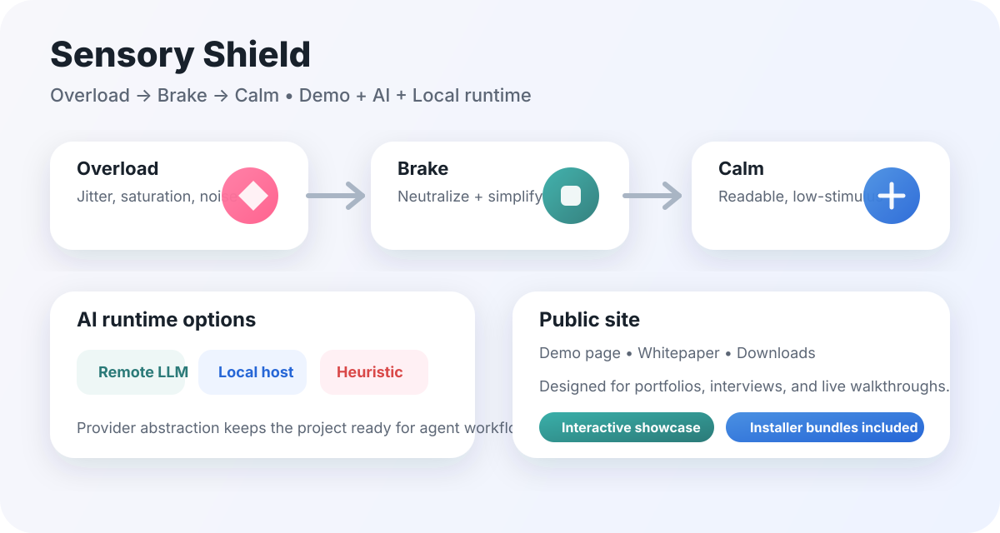

<h1 align="center">Sensory Shield</h1>
<p align="center"><strong>Calm the web. Keep the meaning. Reduce the noise.</strong></p>

[](package.json)
[](manifest.json)
[](manifest.json)
[](package.json)
[](index.html)



## 📚 Table of Contents

- [🎯 Project Overview](#project-overview)
- [✨ Features](#features)
- [🧪 Interactive Demo](#interactive-demo)
- [⚙ How It Works](#how-it-works)
- [🏗 Architecture](#architecture)
- [🚀 Getting Started](#getting-started)
- [📁 Project Layout](#project-layout)
- [🔒 Privacy](#privacy)
- [🌐 Browser Support](#browser-support)
- [❓ FAQ](#faq)
- [🤝 Contributing](#contributing)
- [📖 References](#references)
- [📄 License](#license)

## 🎯 Project Overview

Sensory Shield is a browser extension built to address a practical accessibility challenge: many web pages are technically informative but psychologically exhausting.

The project focuses on:

- identifying a real user pain point
- designing for a specific audience
- making difficult interactions feel simpler
- explaining architecture clearly
- shipping a working demo, not just an idea

This project demonstrates how to turn an abstract accessibility problem into a tangible product.

### 👥 Target Audience

- neurodiverse users
- readers who are overwhelmed by dense pages
- people who want calmer, lower-stimulation interfaces

### 🧩 Problems Addressed

- emotional or sensational language
- visual clutter
- pages that are information-rich but hard to process

### ✅ Evidence of Effectiveness

- a live demo is available
- the extension has real packaging output
- runtime paths are separated and testable

## ✨ Features

Sensory Shield demonstrates capability across four areas:

### 1) Product Thinking

The project starts from user needs and converts them into a usable workflow.

### 2) Front-End Execution

A public landing page, demo mode, and visual system communicate value quickly.

### 3) Extension Architecture

The extension is implemented with Manifest V3 using a service worker, content script, popup UI, and packaging pipeline.

### 4) AI and Runtime Strategy

The runtime supports remote, local, and fallback-based rewrite flows for resilience.

<details open>
<summary><strong>Snapshot</strong></summary>

| Area      | What You Get                                           |
|-----------|---------------------------------------------------------|
| Demo      | Live calm/overload preview on the public page          |
| Extension | Manifest V3 browser extension for Chrome and Edge      |
| AI        | Remote, local, and heuristic runtime modes             |
| Output    | Simplified text, bullet summaries, calmer visual style |
| Bundles   | Downloadable packages for macOS, Windows, and Linux    |

</details>

## 🧪 Interactive Demo

Try the public landing page and switch between calm and overload modes:

- [Open the demo](index.html)
- [View the architecture overview](assets/overview.svg)

<details open>
<summary><strong>Demo states</strong></summary>

| State    | Meaning                                                  |
|----------|-----------------------------------------------------------|
| Calm     | Clean typography, reduced clutter, easier scanning        |
| Overload | Stronger contrast, more visual noise, higher stimulation  |
| Reset    | Returns to the default neutral presentation               |

</details>

## ⚙ How It Works

Sensory Shield is built around three core actions:

1. **Neutralize** emotional or sensational language
2. **Simplify** content into easier-to-scan structure
3. **Reduce** visual overload with calmer styling and fewer distractions

<details open>
<summary><strong>Runtime modes</strong></summary>

| Mode               | Purpose                           | Value Provided                                |
|--------------------|-----------------------------------|-----------------------------------------------|
| Remote LLM         | OpenAI-compatible cloud rewriting | API integration and abstraction                |
| Local runtime      | localhost model usage             | Privacy and offline awareness                  |
| Heuristic fallback | rule-based rewriting              | Resilience when external dependencies are down |

</details>

<details>
<summary><strong>Architecture strengths</strong></summary>

- Keeps the UI usable if a model is unavailable
- Separates demo presentation from page transformation logic
- Enables local testing without a cloud account
- Leaves room for future agentic or multi-model workflows

</details>

## 🏗 Architecture

The scope is intentionally focused: one clear pain point, one visible demo, and one workable extension workflow.

### Technical challenge

Keeping architecture flexible enough to support remote, local, and fallback runtime paths without making the UI confusing.

### Next improvements

- stronger tests
- richer screenshots
- deeper UX evaluation across reading contexts

## 🚀 Getting Started

### Install from Source

1. Clone this repository
2. Open Chrome or Edge
3. Go to the extensions page
4. Enable developer mode
5. Choose **Load unpacked** and select this folder

> This project ships extension packages, not desktop apps.

### Packaged Downloads

Use packaged outputs for distributable builds:

- macOS bundle
- Windows bundle
- Linux bundle

<details>
<summary><strong>Packaging note</strong></summary>

Build scripts produce browser-extension artifacts for realistic testing and distribution.

</details>

### Development Commands

```bash
npm install
npm run build
npm run dist
npm run pack:dmg
npm run pack:exe
npm run pack:linux
```

## 📁 Project Layout

<details>
<summary><strong>Repository structure</strong></summary>

```text
.
├── background.js        # Service worker and runtime routing
├── content.js           # Page transformation and demo behavior
├── demo.js              # Public landing page interactions
├── index.html           # Visual public homepage / demo page
├── manifest.json        # Extension manifest
├── popup.html           # Extension popup UI
├── popup.js             # Popup interactions
├── popup.css            # Popup styling
├── styles.css           # Public site styling
├── assets/
│   └── overview.svg     # Visual overview diagram
└── scripts/
    ├── build.js         # Build extension package
    ├── pack-dmg.js      # macOS bundle builder
    ├── pack-exe.js      # Windows bundle builder
    └── pack-linux.js    # Linux bundle builder
```

</details>

## 🔒 Privacy

- No extension server is required
- No usage analytics are included
- Content processing stays inside the selected runtime path
- API keys remain in the browser environment

## 🌐 Browser Support

| Browser | Status           |
|---------|------------------|
| Chrome  | Supported        |
| Edge    | Supported        |
| Firefox | Not targeted yet |

## ❓ FAQ

<details>
<summary><strong>Is this a desktop app?</strong></summary>

No. It is a browser extension with packaged installs for different platforms.

</details>

<details>
<summary><strong>Do I need an API key?</strong></summary>

Not for the demo. The extension includes fallback paths so the project remains usable in local and offline-friendly setups.

</details>

<details>
<summary><strong>Why keep the README interactive?</strong></summary>

Because the project itself is interactive. The README is designed as a guided project presentation rather than only a static specification.

</details>

## 🤝 Contributing

Contributions are welcome.

1. Fork the repository
2. Create a branch
3. Open a pull request

## 📖 References

Main sources informing accessibility and extension design:

- [Chrome Extensions Manifest V3](https://developer.chrome.com/docs/extensions/mv3/)
- [Microsoft Edge Extension docs](https://learn.microsoft.com/en-us/microsoft-edge/extensions-chromium/)
- [W3C WCAG 2.2](https://www.w3.org/TR/WCAG22/)
- [WAI accessibility tutorials](https://www.w3.org/WAI/tutorials/)
- [Microsoft Inclusive Design](https://inclusive.microsoft.design/)

## 📄 License

MIT © 2024 Sensory Shield Team
